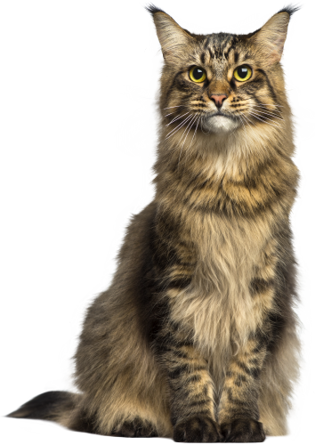
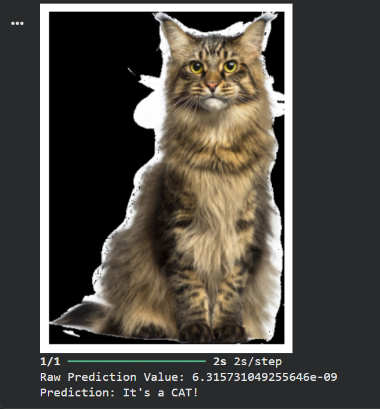
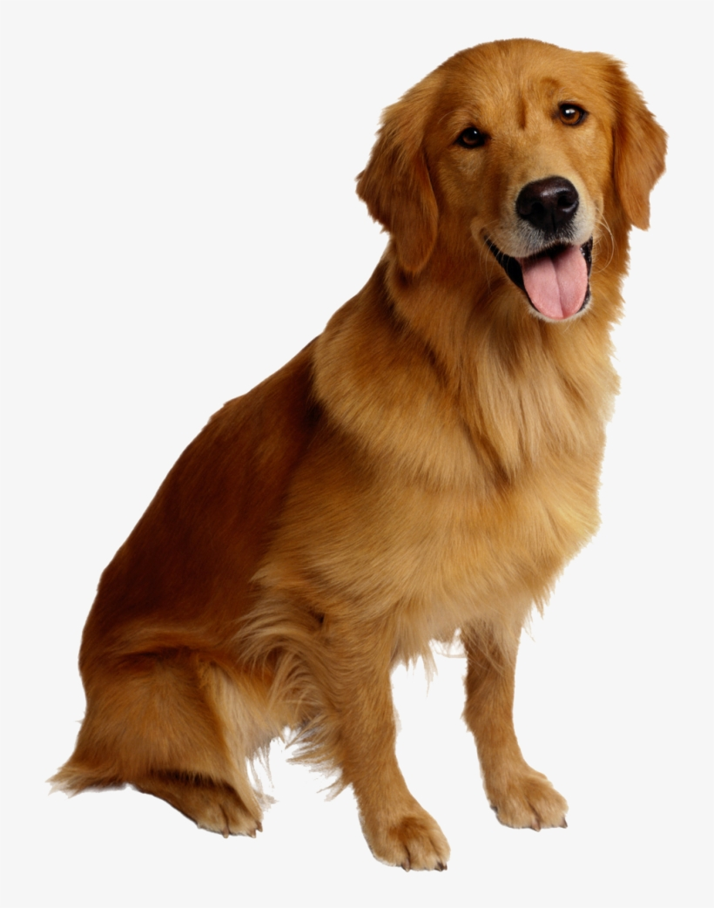
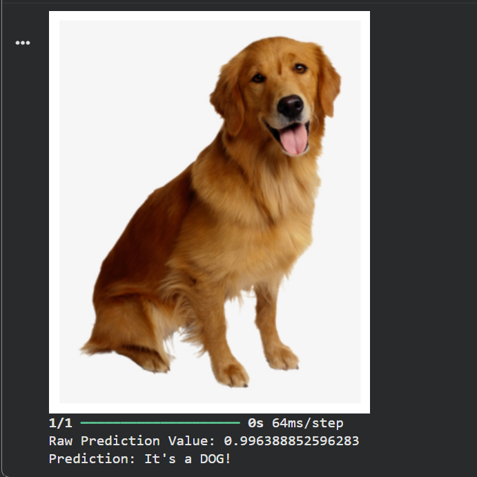

# 🐱🐶 Dog vs Cat Image Classification using CNN

A Deep Learning project that classifies images as either **Dog** or **Cat** using a Convolutional Neural Network (CNN) built with TensorFlow and Keras.

## 📌 Project Overview

This project trains a CNN model on the Kaggle Dogs vs Cats dataset and predicts whether an input image belongs to a dog or a cat. The model learns visual patterns from thousands of images and performs binary image classification.

## 🚀 Features

* Image classification using Convolutional Neural Networks (CNN)
* TensorFlow and Keras implementation
* Image preprocessing and normalization
* Model training and validation
* Prediction on custom images
* Accuracy and loss visualization

## 🛠️ Technologies Used

* Python
* TensorFlow
* Keras
* OpenCV
* Matplotlib
* NumPy

## 📂 Dataset

Dataset: Dogs vs Cats Dataset from Kaggle

Due to GitHub file size limitations, the dataset is not included in this repository.

Download the dataset using:

```python
import kagglehub

path = kagglehub.dataset_download("salader/dogsvscats")
print(path)
```

## ⚙️ Project Workflow

### 1. Dataset Download

The Dogs vs Cats dataset is downloaded from Kaggle and extracted for training.

### 2. Data Loading

Training and validation datasets are loaded using TensorFlow's `image_dataset_from_directory()` function.

### 3. Data Preprocessing

* Images are resized to 256×256 pixels.
* Pixel values are normalized between 0 and 1.

### 4. Model Architecture

The CNN model consists of:

* Convolutional Layers
* Batch Normalization Layers
* Max Pooling Layers
* Fully Connected Dense Layers
* Dropout Layers
* Sigmoid Output Layer for Binary Classification

### 5. Model Training

The model is trained using:

* Adam Optimizer
* Binary Crossentropy Loss
* Accuracy Metric

### 6. Performance Visualization

Training and validation accuracy/loss graphs are generated to evaluate model performance.

### 7. Prediction

Custom images are processed and classified as:

* Cat 🐱
* Dog 🐶

## 📸 Sample Predictions

### Cat Prediction

**Input Image**



**Model Output**



---

### Dog Prediction

**Input Image**



**Model Output**



## 📁 Project Structure

```text
Dog_vs_Cat_Classifier/
│
├── Image_Classification.ipynb
├── README.md
├── requirements.txt
│
├── Cat_Input.png
├── Cat_Output.png
├── Dog_Input.png
├── Dog_Output.png
│
└── model/
```

## 🎯 Future Improvements

* Transfer Learning using ResNet50 or MobileNet
* Streamlit Web Application Deployment
* Real-time Image Classification
* Model Performance Optimization
